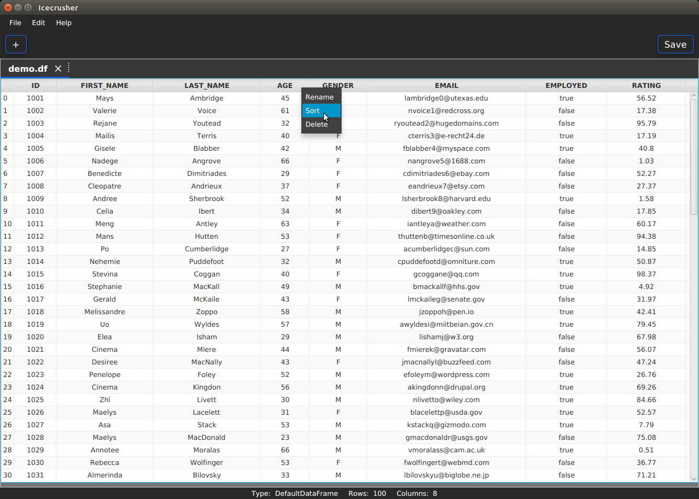

# Icecrusher
#### A Simple Editor for DataFrame Files

  

Icecrusher is a simple editor for DataFrame files (.df) with a modern-looking user interface. It is an open-source application and entirely implemented in JavaFX. It can read, edit, filter and create *.df* files. Additionally, it also suppports the capability to import and export CSV files.

If you want to work with DataFrame files in your Java code, you can use the [Claymore](https://github.com/kilo52/claymore/) library which is also open source.

You may download the [Demo](https://github.com/kilo52/icecrusher/raw/master/demo/demo.df) file and try out Icecrusher for yourself.

## Installation

There are installers available for both **Windows** and **Linux**. When executed, they will install Icecrusher on your operating system. 
You don't necessarily need a JRE and JavaFX as the installer provides a private copy of a native JRE which will be used by the application. 

## Build

If you want to build Icecrusher from source you will need the JDK and JavaFX (both minimum version 8).
I am currently using the *javafx-maven-plugin* to build the packages, although this may change in the future.
The standard *mvn package* command will package the application as a *jar* and put it into the *bin/dist/app/* directory. That will not, however, build a self-contained application bundle that includes a JRE. As long as you have a JRE and JavaFX installed on your system you can directly execute *icecrusher.jar*. If you want to build a native installer, I suggest you use either *dpgk-deb* (on linux) or *Inno Setup* (on windows), depending on your operating system.

## Contact

If you encountered a bug or have a feature request, consider opening an issue on GitHub.
Alternatively, you may send me an e-mail: phil.gaiser.k52@gmail.com

## License

Icecrusher is licensed under the Apache License Version 2 - see the [LICENSE](LICENSE) for details.
The JRE which is part of each native installer is subject to its own license. Please inform yourself about such if you plan to build, extend, distribute either this application or any Oracle products.
Disclaimer: I do not own, maintain or sell any software product as part of the JDK or JRE.

